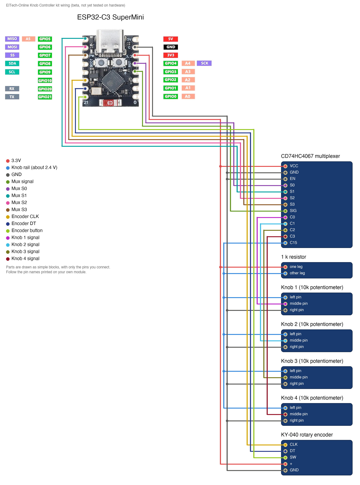

# ElTech-Online ESP32-C3 Knob Controller

[](https://buymeacoffee.com/eltech)

> **Status: BETA, not tested.** The code compiles for the ESP32-C3, but this kit has not been built and tested on real hardware yet. Pin choices, default values and the wiring may still change. Use it to read and learn from; expect to do some fault-finding if you build it now.

A beginner-friendly **learning kit**: build a wireless music controller from an **ESP32-C3 SuperMini**, a **CD74HC4067 16-channel multiplexer**, four **10 kΩ potentiometers**, a **1 kΩ resistor** and a **KY-040 rotary encoder**. It shows up on a phone, tablet or computer as a standard **Bluetooth MIDI** device, so its knobs can work the controls of any music app. No prior electronics or coding experience needed, and no soldering: everything plugs into a breadboard.

Designed, coded and documented by ElTech-Online in Callander, Scotland — the kit design, firmware and this guide are our own work.


## What you'll learn

Two techniques, one for getting more inputs and one for getting them out:

- **Multiplexing** — reading up to 16 analog parts through a single analog pin
- **Binary addressing** — how four wires choose one of sixteen channels
- **Bluetooth Low Energy** — services, characteristics and advertising
- **MIDI** — the 40-year-old language of music gear, and what a Control Change message is

Along the way you'll also pick up:

- **Voltage dividers and ratiometric measurement** — one resistor fits the knobs to the ADC's range, and measuring against a reference removes the need to calibrate
- **Smoothing and hysteresis** — stopping a knob that rests between two values from flickering
- **Reading a rotary encoder** with an interrupt
- **Following a published standard** (BLE-MIDI) so other people's software just works with your device

The code is written to be read: every section is commented in plain language, and [How the code works](#how-the-code-works) walks through it.

## How the parts work

**The multiplexer.** The ESP32-C3 has only five analog pins. The CD74HC4067 is a 16-way rotary switch worked by electricity: its `SIG` pin is connected to one of sixteen channel pins (`C0` to `C15`), and four select pins choose which. Together `S3 S2 S1 S0` spell the channel number in binary:

| Channel | S3 | S2 | S1 | S0 |
|---|---|---|---|---|
| 0 | 0 | 0 | 0 | 0 |
| 1 | 0 | 0 | 0 | 1 |
| 2 | 0 | 0 | 1 | 0 |
| 3 | 0 | 0 | 1 | 1 |
| ... | | | | |
| 15 | 1 | 1 | 1 | 1 |

The sketch sets the four pins, waits a moment, reads the analog pin, and moves on to the next channel, a hundred times a second. Four knobs are in the kit and one channel measures their supply; the other eleven channels are free for your own.

**The resistor.** The ESP32-C3 can only measure accurately up to about 2.5 V. A knob wired straight across 3.3 V would go past that, and the last quarter of its travel would do nothing. So the knobs get their own supply, the **knob rail**, fed from 3.3 V through a 1 kΩ resistor. The four 10 kΩ knobs side by side behave like one 2.5 kΩ resistor, and the two form a voltage divider:

```
rail = 3.3 V × 2.5 kΩ / (1 kΩ + 2.5 kΩ) = about 2.36 V
```

Potentiometers are not precise parts (±20 %), so your rail may be anywhere from 2.2 to 2.5 V. The sketch doesn't guess: the rail is also wired to multiplexer channel `C15`, the board measures it, and each knob's position is its voltage as a fraction of the rail's. That is a **ratiometric** measurement, and it means the knobs need no calibration.

**MIDI.** A knob on a MIDI controller sends a **Control Change** message: three numbers saying which channel (1 to 16), which control (0 to 127) and its new value (0 to 127). The message says nothing about what the control *does*: the app decides, usually with a "MIDI learn" button.

**Bluetooth MIDI.** A Bluetooth Low Energy device offers *services*, each containing *characteristics* that data goes in and out of, and each has a long ID number. BLE-MIDI is simply an agreement that a MIDI device offers a service with one particular ID. Any app that knows the agreement can use any such device, with no driver.

## What it does

- Four knobs send Control Change 1 (modulation), 7 (volume), 10 (pan) and 74 (filter cutoff)
- The encoder sends Control Change 20, up or down two steps per click, and its push button toggles Control Change 21
- Appears over Bluetooth as **ElTech Knobs**; the board's blue LED lights while a device is connected
- Prints every message to Serial (115200 baud), so the knobs can be tested with nothing connected

It also runs a self-test at power-on and prints it to Serial (115200 baud):

```
--- Self-test ---
Knob 1 (C0):  1210 mV (turn it and check the CC messages below)
Knob 2 (C1):   340 mV (turn it and check the CC messages below)
Knob 3 (C2):  2280 mV (turn it and check the CC messages below)
Knob 4 (C3):    60 mV (turn it and check the CC messages below)
Knob rail:     OK (2362 mV on C15)
Encoder:       OK
Bluetooth:     advertising as "ElTech Knobs"
RESULT:        PASS
```

The knobs can only be read, not detected, so turn each one and watch its `CC` line change. `Knob rail: BAD READING` with a figure near 2900 mV or more means the 1 kΩ resistor is missing or bypassed.

There are **two sketches** in this repo:

| Sketch | What it is |
|---|---|
| `mux_test/` | The smallest useful start: prints the voltage of the four knobs twice a second. Begin here. |
| `knob_controller/` | The full project: multiplexer + knobs + encoder + Bluetooth MIDI. |

## Hardware

| Component | Notes |
|---|---|
| ESP32-C3 SuperMini |  |
| CD74HC4067 multiplexer breakout | `SIG`, `S0`–`S3`, `EN`, `VCC`, `GND` on one edge and `C0`–`C15` on the other |
| 4 × 10 kΩ potentiometer (WH148 type) | 3 pins each. The middle one is the output |
| 1 kΩ resistor | Brown, black, red, gold bands. It has no polarity: either way round |
| KY-040 rotary encoder module | 5 pins: `CLK`, `DT`, `SW`, `+`, `GND` |
| Breadboard + jumper wires | 27 wires |

## Wiring

| Wire | ESP32-C3 pin | Connects to |
|---|---|---|
| 3.3V | 3V3 | CD74HC4067 multiplexer `VCC`, 1 kΩ resistor `one leg`, KY-040 rotary encoder `+` |
| Knob rail (about 2.4 V) | — | 1 kΩ resistor `other leg`, Knob 1 `left pin`, Knob 2 `left pin`, Knob 3 `left pin`, Knob 4 `left pin`, CD74HC4067 multiplexer `C15` |
| GND | GND | CD74HC4067 multiplexer `GND`, CD74HC4067 multiplexer `EN`, Knob 1 `right pin`, Knob 2 `right pin`, Knob 3 `right pin`, Knob 4 `right pin`, KY-040 rotary encoder `GND` |
| Mux signal | GPIO 3 | CD74HC4067 multiplexer `SIG` |
| Mux S0 | GPIO 4 | CD74HC4067 multiplexer `S0` |
| Mux S1 | GPIO 5 | CD74HC4067 multiplexer `S1` |
| Mux S2 | GPIO 6 | CD74HC4067 multiplexer `S2` |
| Mux S3 | GPIO 7 | CD74HC4067 multiplexer `S3` |
| Encoder CLK | GPIO 10 | KY-040 rotary encoder `CLK` |
| Encoder DT | GPIO 20 | KY-040 rotary encoder `DT` |
| Encoder button | GPIO 21 | KY-040 rotary encoder `SW` |
| Knob 1 signal | — | Knob 1 `middle pin`, CD74HC4067 multiplexer `C0` |
| Knob 2 signal | — | Knob 2 `middle pin`, CD74HC4067 multiplexer `C1` |
| Knob 3 signal | — | Knob 3 `middle pin`, CD74HC4067 multiplexer `C2` |
| Knob 4 signal | — | Knob 4 `middle pin`, CD74HC4067 multiplexer `C3` |



The parts are drawn in a simplified way, showing only the pins you connect. **Always follow the labels printed on your own modules** — the pin order differs between manufacturers.

Good to know:

- **Three rails.** 3V3 and GND go on the breadboard's power rails as usual. The **knob rail** is a third one: use the breadboard's other power strip, or one spare row.
- **The resistor bridges 3V3 to the knob rail.** One leg in the 3V3 rail, the other in the knob rail. Nothing else connects the two.
- **Each knob** has one outer pin on the knob rail and the other on GND. The knobs do **not** connect to 3V3 directly.
- **C15 to the knob rail**, so the board can measure it.
- **EN to GND** switches the multiplexer on. Left unconnected, it reads nothing.
- **GPIO 3** is the analog pin. On the ESP32-C3 only GPIO 0–4 can read analog voltages.
- **A knob works backwards?** Swap the wires on its two outer pins.
- **GPIO 20 and 21** are free here because the board talks to the computer over USB, not over those serial pins.
- **This kit does not use WiFi.**

## Setup (Arduino IDE)

**Before you start:** download and install the free **Arduino IDE 2** from [arduino.cc/en/software](https://www.arduino.cc/en/software). The ESP32-C3 connects over its own USB-C port, so there's no separate USB driver to install. Use a USB cable that carries data: some cheap cables only charge, and then the board never shows up.

1. **Add the ESP32 board index**: `File > Preferences` → Additional Boards Manager URLs:
   ```
   https://raw.githubusercontent.com/espressif/arduino-esp32/gh-pages/package_esp32_index.json
   ```
2. **Install the board package**: `Tools > Board > Boards Manager`, search "esp32", install **esp32 by Espressif Systems**.
3. **Select the board**: `Tools > Board > esp32 > ESP32C3 Dev Module`.
4. **Tools menu settings**:

   | Setting | Value |
   |---|---|
   | Board | ESP32C3 Dev Module |
   | USB CDC On Boot | Enabled |
   | CPU Frequency | 160MHz |
   | Erase All Flash Before Sketch Upload | Disabled |
   | Flash Size | 4MB (32Mb) |
   | Partition Scheme | Default 4MB with spiffs (1.2MB APP/1.5MB SPIFFS) |
   | Upload Speed | 921600 |

5. **Libraries:** none to install. Everything this kit uses is built into the ESP32 board package.

   **Compiled with** these versions (compile-tested only; hardware confirmation pending):

   | Package | Version |
   |---|---|
   | esp32 by Espressif Systems (board package) | 3.3.11 |

6. Open `mux_test/mux_test.ino` first, upload it, and check all four knobs. Then open `knob_controller/knob_controller.ino` and upload that.

### Opening the Serial Monitor

1. Open it with `Tools > Serial Monitor`.
2. Set the speed drop-down to **115200 baud**. At the wrong speed, you'll see garbled characters or nothing at all.
3. The self-test only runs once, right after the board starts. If you opened the Serial Monitor too late, press the board's **RST** (reset) button to run it again.

**Seeing nothing at all?** Check that `Tools > USB CDC On Boot` is set to **Enabled**.

### If the upload fails

If the upload stops with an error like `Failed to connect`, put the board into download mode by hand:

1. Hold down the **BOOT** button on the board.
2. While holding it, press and release **RST** (or unplug and re-plug the USB cable).
3. Release **BOOT**, choose the port under `Tools > Port` and click **Upload** again.
4. When the upload finishes, press **RST** once to start the new code.

## Connecting to a music app

A Bluetooth MIDI device does **not** appear in the normal Bluetooth settings list. You connect from inside a music app or a MIDI settings screen:

- **iPhone / iPad:** GarageBand → Settings (gear icon) → Advanced → Bluetooth MIDI Devices → **ElTech Knobs**. Many other music apps have the same screen.
- **Mac:** Audio MIDI Setup → Window → Show MIDI Studio → the Bluetooth icon → **ElTech Knobs** → Connect.
- **Windows and Android:** support depends on the app. Look for a "Bluetooth MIDI" or "BLE MIDI" option in its settings.

The board's blue LED lights when a device connects. Then use the app's **MIDI learn** feature: choose a control on screen, turn a knob, and the two are tied together.

## How the code works

Open `knob_controller/knob_controller.ino` alongside this section. The file starts with a short guide to its own layout. Every Arduino sketch has two main functions: `setup()` runs once when the board starts, and `loop()` then runs over and over, forever.

1. **Settings at the top.** Pins, the device name, the MIDI channel and each knob's control number are named values you can change in one place.
2. **Choosing a channel.** `selectMuxChannel()` writes the channel number to the four select pins, one binary digit each.
3. **Reading the knobs.** `readKnobs()` first measures the knob rail on channel 15, then smooths each knob's voltage, scales it to 0–127 as a fraction of the rail, and sends a message only when the value has really changed.
4. **Bluetooth.** `startBluetoothMidi()` creates the MIDI service and characteristic and starts advertising.
5. **Sending a message.** `sendControlChange()` builds the 5-byte BLE-MIDI packet. The comment above it explains each byte.
6. **The encoder.** `encoderTurned()` is the interrupt that counts clicks; `readEncoder()` turns them into a value and handles the button.

## Try this next

Small changes to try yourself, roughly easiest first. Change one thing, upload, and check the result before moving on.

1. **Change what the knobs control.** Edit the numbers in `KNOB_CC`.
2. **Rename the device.** Edit `DEVICE_NAME`.
3. **Add more knobs.** Wire a fifth potentiometer to `C4` (outer pins to the knob rail and GND), raise `KNOB_COUNT` to 5 and add its control number. The rail drops a little with each knob you add, and the sketch allows for it by itself.
4. **Make the encoder send notes.** Send Note On (`0x90`) and Note Off (`0x80`) messages instead of a Control Change, and play a scale by turning it.
5. **Add a second page of controls.** Let the encoder's button switch the four knobs between two sets of control numbers.
6. **Add a slider or a light sensor** on a spare channel: anything that gives a voltage can be a MIDI control.

## Beta notes

This repository is published early. Still to be confirmed on real hardware:

- Bluetooth MIDI on the ESP32-C3 with iOS, macOS, Windows and Android (some systems want the device to be paired/bonded first)
- The knob rail's real voltage with the kit's own potentiometers and 1 kΩ resistor (expected 2.2 to 2.5 V), and whether each knob reaches both 0 and 127
- Whether the WH148 potentiometers' legs sit firmly in a breadboard
- The power-on check for the encoder assumes the module has pull-up resistors on CLK and DT

Found a problem? Please open an issue on this repository.

## License

The code, documentation and wiring diagram are MIT-licensed — see [LICENSE](LICENSE). Use them, modify them, build your own kit with them.

**The ElTech-Online name and logo are not covered by the MIT license.** The logo files (`logo.png` and any `logo_bitmap.h`) are © ElTech-Online, all rights reserved. If you build or sell your own version, swap in your own logo and don't present it as an ElTech-Online product.
